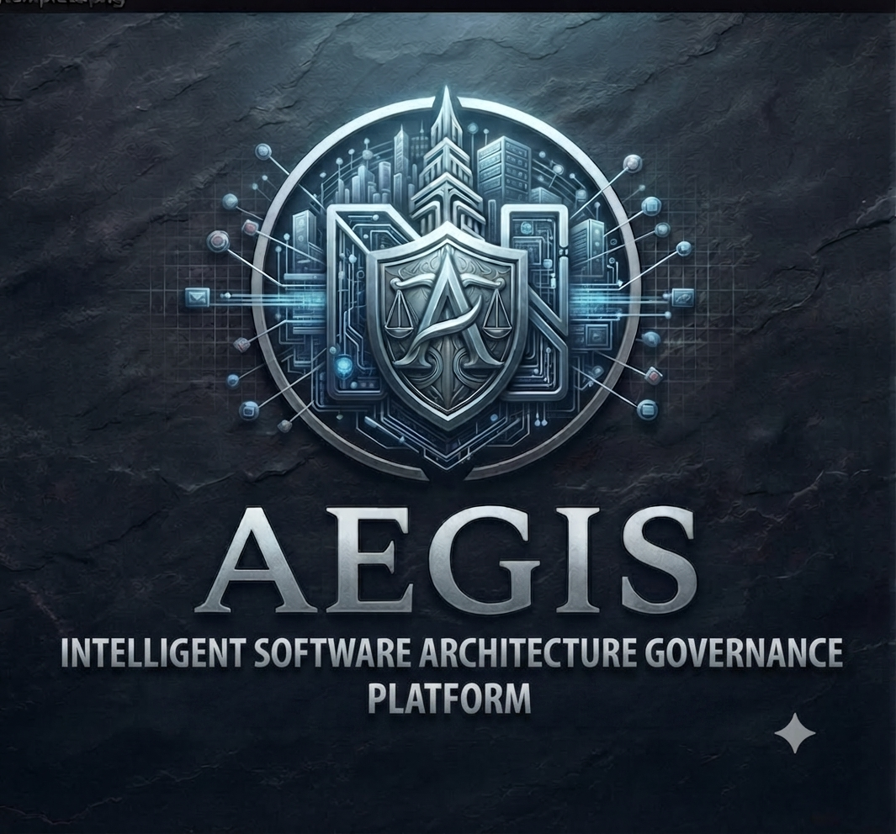

<p align="center">  </p>

# Aegis

> Deterministic security & architecture analysis for modern .NET platforms  
> OS · Network · TLS · Cloud · WCF · FileSystem · Architecture · Governance · ISO 27001

Aegis is a **security & architecture governance engine** built on **.NET 10**.

It combines:

- low-level **security probes** (TLS, ports, OS, filesystem, cloud, WCF…),
- a strongly-typed **security rule engine** (ISO 27001–aware),
- and higher-level **architecture & compliance models**

to produce **deterministic, auditable security reports** that you can plug into CI/CD, dashboards, and enterprise governance processes.

Aegis is designed as a **framework and product**:

- As a *framework*, you can add your own probes, rules, and policies.
- As a *product*, you’ll have WPF dashboards, a CLI, and (later) MAUI frontends for interactive analysis.

---

## Key Scenarios

Aegis is built for teams that need to:

- **Enforce security baselines automatically**  
  Check TLS, OS hardening, open ports, WCF bindings, filesystem secrets, cloud misconfigurations…

- **Prepare for audits (ISO 27001 and friends)**  
  Map findings to ISO controls, OWASP, CWE, CIS, etc. Generate structured reports and risk summaries.

- **Govern architecture & technical debt**  
  (Aegis.Architecture) — ensure projects follow architecture rules, layering, naming, dependency boundaries.

- **Integrate security into DevSecOps**  
  Run Aegis in CI pipelines, fail builds on critical findings, export machine-readable results.

- **Feed higher-level tools & AI advisors**  
  Aegis is designed to plug into ecosystems like **Franz** (microservices framework) and **ArchenaAI** (AI advisor) as the “ground truth” security/architecture scanner.

---

## High-Level Architecture

Aegis follows a strict pipeline:

```text
[ Probes ]  →  [ SecuritySignals ]  →  [ Evaluators + RuleSets ]
            →  [ SecurityEvaluationResult ] 
            →  [ SecurityScanSummary ] 
            →  [ AegisSecurityReport ]
            →  [ Governance / Compliance Engine ]
````

### 1. Probes (Kernel)

Probes gather raw security data from different layers:

* **Http/TLS**

  * `TlsScanner` — negotiates TLS, captures protocol, cipher suite, certificate, key size, expiration.
* **Network**

  * `NetworkPortScanner` — checks if ports are open, latency, basic reachability.
* **OS**

  * `OsInfoProbe`, `OsHardeningProbe`, `ProcessScannerProbe`, `EnvironmentVariableProbe`.
* **FileSystem**

  * `FileSystemScanner` — checks sensitive files, extensions, world permissions, secret patterns.
* **Crypto**

  * Crypto scanner(s) for algorithm usage and weak hashing/encryption flags.
* **Cloud**

  * `CloudBucketProbe`, `CloudNetworkProbe`, `CloudIamProbe` — public buckets, open security groups, IAM/identity issues.
* **WCF**

  * `WcfSecurityProbe` — bindings, HTTPS usage, anonymous access, metadata exposure.

Each probe returns **immutable** domain-specific `SecuritySignal` instances.

### 2. Security Signals

Signals are the **atomic evidence unit** in Aegis:

* `TlsSecuritySignal`
* `PortSecuritySignal`
* `OsInfoSecuritySignal`
* `OsHardeningSecuritySignal`
* `EnvironmentVariableSecuritySignal`
* `ProcessSecuritySignal`
* `FileSystemSecuritySignal`
* `CloudBucketSecuritySignal`
* `CloudNetworkSecuritySignal`
* `CloudIamSecuritySignal`
* `WcfSecuritySignal`
* …and more as the engine grows.

Each `SecuritySignal` includes:

* Category (`Network`, `OS`, `FileSystem`, `Cloud`, `WCF`, etc.)
* Detector ID (which probe produced it)
* Evidence string
* Severity/score (optional pre-classification)
* Metadata (always JSON-serializable)
* Timestamp

Signals are **never mutated**; evaluators interpret them.

### 3. Evaluators & Rule Engine

Evaluators are domain-specific analyzers implementing `ISecurityEvaluator`:

* `OsSecurityEvaluator`
* `NetworkSecurityEvaluator`
* `TlsSecurityEvaluator`
* `FileSystemSecurityEvaluator`
* `CloudSecurityEvaluator`
* `WcfSecurityEvaluator`
* `GovernanceSecurityEvaluator`
* (and others)

They:

1. Filter signals for their domain,
2. Apply **rule sets** (`SecurityRuleSet`) with `SecurityRuleDefinition` entries,
3. Generate `SecurityRuleResult` + `SecurityEvaluationResult` instances.

A generic `SecurityEvaluatorEngine` coordinates all evaluators and returns a set of `SecurityEvaluationResult` objects.

### 4. Rule Sets (Governance & ISO)

Rule definitions live in `Aegis.Shared.Security.Models.Rules` and `*.Rules.Sets` and are created via `SecurityRuleSetFactory`.

Examples:

* **Governance & Logging rules**

  * Missing audit logging
  * No SIEM forwarding
  * Missing log retention policy
  * No log integrity / immutability

* **ISO/IEC 27001 Annex A (2022) rule set**

  * A.5.17 — Identity management (guest/default accounts)
  * A.8.1 — Endpoint security (unencrypted sensitive files)
  * A.8.10 — Logging
  * A.12.2 — Malware protection (suspicious processes)
  * A.12.6 — Technical vulnerability management (outdated/vulnerable dependencies)
  * A.13.2 — Secure transmission (weak TLS)
  * A.14.1 — Secure development lifecycle (hard-coded secrets)

Each rule is mapped to:

* `SecurityCategory` (OS, Network, FileSystem, Cloud, Governance, Application…)
* `SecuritySeverity` & `RiskLevel`
* ISO control ID
* Optional OWASP, CWE, CIS, etc.
* Evidence pattern (regex), tags, affected artifacts, remediation, references.

### 5. Reporting & Compliance

Aegis aggregates evaluator results into:

* `SecurityScanSummary` — aggregated view of all domains.
* `AegisSecurityReport` — full report with:

  * Project name, engine version, policy version,
  * Execution timestamps & duration,
  * Scan summary & global risk,
  * Optional metric snapshots and inference traces,
  * Execution metadata (branch, commit, pipeline run ID…).

On top of that, the **governance layer** provides:

* `SecurityComplianceResult`

  * Per-domain compliance verdicts (`DomainComplianceResult`),
  * Global risk level,
  * Compliance rate,
  * Pass/fail flag based on thresholds.

This is where ISO 27001 / CIS / other standards can be applied to a given report.

---

## Solution Structure

> Folder names may evolve; this is the current intent of the architecture.

* `Aegis.Architecture`
  Static architecture analysis: dependency rules, layering, naming, architectural constraints for .NET solutions.

* `Aegis.Security`
  Core security kernel (probes, signals, evaluators, rule sets, governance, compliance engine).

* `Aegis.Shared.Security`
  Shared models, enums, rule definitions, and cross-cutting types used by both architecture & security domains.

* `Aegis.App.Wpf`
  WPF dashboard (on .NET 10 / Windows) for interactive visualization of:

  * Scan results,
  * Risk levels,
  * Trends and aggregation.

* `Aegis.App.Maui` (planned)
  Cross-platform MAUI UI for dashboards & field use.

* `Aegis.Cli`
  Command-line interface for CI/CD pipelines and headless scans.

* `Aegis.Sdk`
  SDK surface for host applications and external tools (e.g., Franz, ArchenaAI) to run scans programmatically.

---

## Status

Aegis is currently in **internal alpha**:

* ⚙️ Security kernel is functional and evolving
* 📦 Public packaging (NuGet, tool distribution) is **not** finalized
* 📊 Dashboards & UI are under active development
* 📚 Documentation and examples are being written
* 🔐 APIs and contracts may still change

Use with care in production. The goal is to grow Aegis into a **deterministic, audit-grade security & architecture platform** usable in:

* Enterprises,
* Regulated environments,
* Public institutions,
* And internal R&D / architecture guilds.

---

## Getting Started (Developer)

> **Prerequisites**
>
> * .NET 10 SDK (preview or nightly)
> * Visual Studio 2026 or `dotnet` CLI
> * Windows 10+ for WPF frontend

### 1. Clone & Build

```bash
git clone https://github.com/bestacio89/Aegis.git
cd Aegis

dotnet build
```

### 2. Run the CLI (prototype)

> Adjust project path as needed once the CLI project layout stabilizes.

```bash
dotnet run --project sources/Aegis.Cli -- scan --path .
```

Typical responsibilities of the CLI (current / planned):

* Discover relevant probes based on flags (`--network`, `--tls`, `--os`, `--filesystem`, `--cloud`, `--wcf`, …)
* Execute probes and evaluators
* Apply rule sets (baseline / ISO27001 / custom)
* Produce:

  * Human-readable console summary
  * JSON report (`AegisSecurityReport`) for downstream tools

### 3. Run the WPF Dashboard (prototype)

```bash
dotnet run --project sources/Aegis.App.Wpf
```

The WPF app is intended to:

* Load scan reports,
* Visualize findings per domain and per rule set,
* Display risk trends over time,
* Prepare material for security reviews & architecture boards.

---

## Integration & Extensibility

Aegis is designed to be **embedded**:

* As a library in **.NET microservices** (Franz ecosystem),
* As a back-end security engine for **AI advisors** (ArchenaAI),
* As a **governance service** in larger platforms.

You can:

* Add new `SecuritySignal` types,
* Implement new `ISecurityEvaluator` instances,
* Register custom `SecurityRuleSet` collections,
* Extend the compliance engine with your own policies.

---

## Roadmap (High-Level)

Planned directions include:

* **More standards:**
  NIST SP 800-53, CIS Benchmarks, CSA CCM, sector-specific profiles (healthcare, finance, public sector).

* **Architecture domain expansion:**
  Stronger rules around coupling, layering boundaries, technology stacks, and cross-service contracts.

* **Reporting:**

  * PDF / HTML export of security reports,
  * Statement of Applicability (SOA) generator for ISO 27001,
  * SARIF export for code scanning / GitHub Advanced Security.

* **Dashboards & UX:**

  * Rich WPF dashboards,
  * MAUI cross-platform client,
  * Drill-down views for auditors and architects.

* **Cloud & Runtime:**

  * Deeper Azure / AWS / GCP integration,
  * Container/Kubernetes/IaC scanners,
  * Runtime telemetry ingestion.

* **AI-assisted governance:**

  * Integration with ArchenaAI to suggest remediations,
  * Rule authoring assistance,
  * Architecture-aware security recommendations.

---

## License

> ⚠️ License is not yet finalized.
> Until a LICENSE file is added, assume **all rights reserved** and use only for personal evaluation.

---

## Contributing

Aegis is currently developed as a **focused architecture & security project**.
External contributions are welcome in the future, once:

* The public API stabilizes,
* The licensing model is finalized,
* And contribution guidelines are published.

For now, feel free to:

* Open issues with ideas or feedback,
* Use the code as inspiration for your own security/architecture tooling,
* Watch the project as it evolves.

---

## Contact

Maintainer: **Bernardo Estacio Abreu**

If you’re interested in:

* Using Aegis in a regulated environment,
* Integrating it with your .NET microservices and CI/CD,
* Or aligning security scans with ISO 27001 / NIST / CIS for your org,

you can reach out via GitHub profile.

---

```

